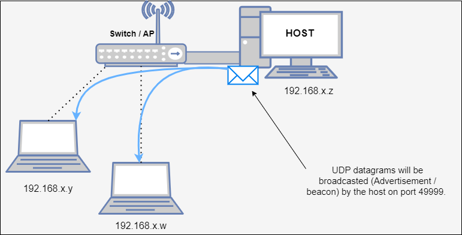
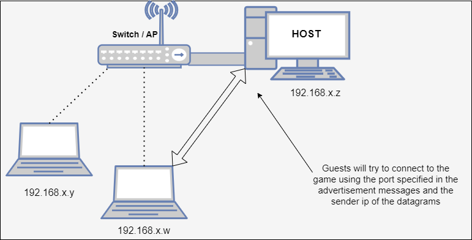
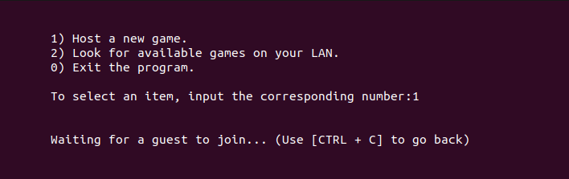

# Tris_LAN

This program allows players to connect and play tris if they are connected to the same LAN.
There is no need to know the ips or the ports, the game will recognise available games on the lan (the hosts broadcast "advertisement" datagrams on a non registered port, 49999).

The host and the guest process communicate by using a simple protocol (defined in protocol.h).

## Compilation
To compile, execute:
gcc -o tris common.c communication.c discovery.c gameLogic.c minilogger.c TrisLAN.c
Then execute the program (no parameters needed).

## Testing

The text interface is sufficient to test the program.
The resynchronization feature is not implemented yet.

To read the logs, modify common.h by uncommenting 
#define DEBUG
and recompiling.
